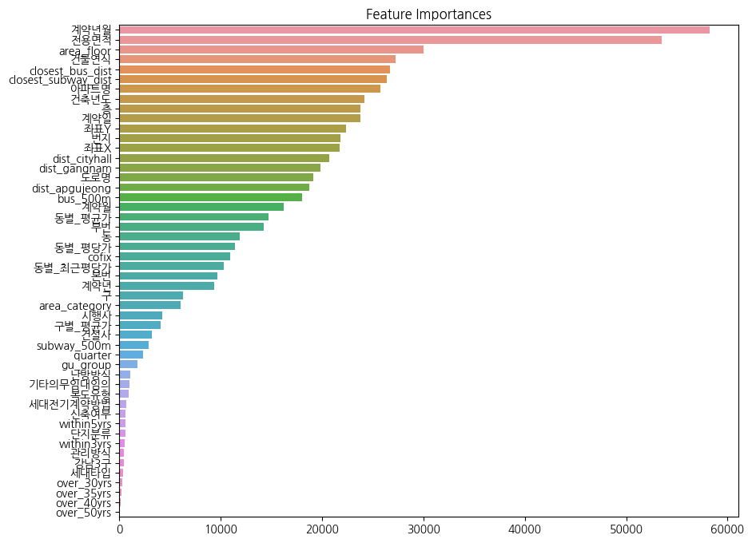

# 🏠 Seoul Apartment Price Prediction

> 서울시 아파트 실거래가를 예측하는 머신러닝 회귀 모델 개발 프로젝트

## 📋 Overview

| Item | Detail |
|------|--------|
| **Period** | 2026.01.06 - 2026.01.11 |
| **Task** | Regression (House Price Prediction) |
| **Goal** | 일반화된 모델을 개발하여 아파트 시장의 동향을 미리 예측 |
| **Result** | RMSE 68.7% 개선 (47,133 → 14,751) |
| **Stack** | Python, LightGBM, XGBoost, Scikit-Learn |

---

## 📊 Dataset

**Source**: 국토교통부 아파트 실거래가 데이터 + 서울시 지하철역/버스정류장 정보 데이터

| Dataset | Period | Size |
|---------|--------|------|
| Train | 2007.01 ~ 2023.06 | 1,118,822 rows, 52 features |
| Test | 2023.07 ~ 2023.09 | 9,272 rows |

---

## 🔍 Approach

### 1. EDA

- **Log 변환**: 부동산 거래 특성상 오른쪽으로 꼬리가 긴 (Right Skewed) 분포 확인 → y변수에 로그 변환 적용
- **결측치 보완**: 카카오맵 API로 아파트의 위도/경도 좌표 결측치 보완 (약 88만건)

### 2. Feature Engineering

**좌표 기반 거리 파생변수**

Feature Importance 분석에서 좌표 정보의 중요성을 확인하고, 하버사인(Haversine) 공식을 활용하여 주요 거점까지의 거리 변수를 생성:

$$d = 2R \cdot \arctan2\left(\sqrt{a},\ \sqrt{1-a}\right)$$

$$a = \sin^2\left(\frac{\Delta\phi}{2}\right) + \cos(\phi_1)\cos(\phi_2)\sin^2\left(\frac{\Delta\lambda}{2}\right)$$

- 강남역/압구정역/시청역까지의 거리 (km)
- 500m 반경 내 역/정류장 수, 최근접 역/정류장까지의 거리

**타겟 인코딩**

- 구별 평균가, 동별 평균가, 동별 평당가, 동별 최근 5년 평당가

**기타**
- 강남3구, gu_group(구별 매매가 mean, std로 kmeans수행하여 5개 그룹화)
- 건물연식, 신축여부, within5yrs, within3yrs, over_30yrs, over_40yrs, over_50yrs
- 고층*면적, 평형대 범주화(소/중소/중대/대형)
- 금리
- 분기

### 3. Model Selection

| Model | Initial Valid RMSE |
|-------|-------------|
| Random Forest | 5850.79 |
| XGBoost | 4403.02 |
| **LightGBM** | **4114.19** |
| 앙상블 (XGB+LGBM) | 4225.73 |

- XGBoost 대비 대용량 데이터(111만건)에 적합한 LightGBM의 학습 속도/성능 우수
- Model Selection 후 LightGBM 단일모델로 최종 선정

### 4. Validation Strategy

**Time Series Split Cross Validation** 적용

- Random Split 적용 시 미래데이터로 과거를 예측하는 오류 발견
- 시계열 데이터의 특성을 감안하여 시간 순서 보장

```
Train set : 2007.01 ~ 2022.12
Valid set : 2023.01 ~ 2023.06
```

### 5. Hyperparameter Tuning

LightGBM 단일모델로 하이퍼파라미터 튜닝 실험 반복:

```python
final_params = {
    'n_estimators': 20000,
    'learning_rate': 0.005,
    'num_leaves': 127,
    'min_child_samples': 20,
    'feature_fraction': 0.8,
    'objective': 'regression',
    'metric': 'rmse'
}
```

### 6. Feature Selection

Feature Importance 분석 통해 유의미한 변수 22개 선택:

> 파생변수가 많다고 해서 모델 성능이 개선되는 것은 아님 → Feature Selection 중요




---

## 📈 Result
RMSE: 47,133 → 14,751 (68.7% 개선)

---

## 💡 Key Insights

1. 빠른 실험 확인 가능하며 대용량 데이터에 적합한 **LightGBM의 특성** 확인
2. 데이터 특성에 따른 **Cross Validation 전략 수정**이 중요함
3. 파생변수가 많다고 해서 모델 성능이 개선되는 것은 아님
4. 상관분석, Feature Importance 등 통해서 **유의미한 Feature Selection** 중요

---

## 🛠 Tech Stack


